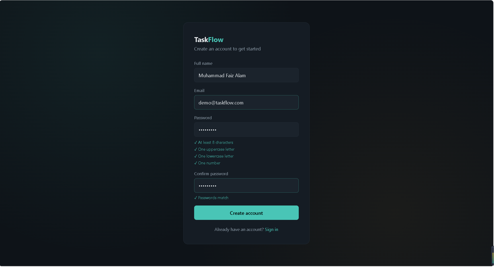
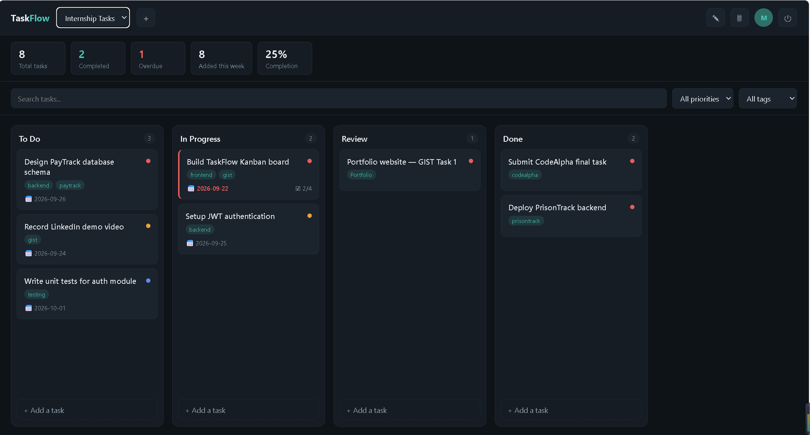
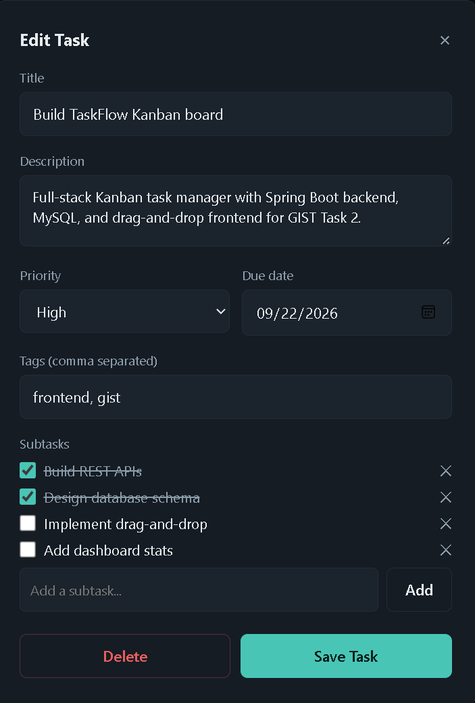
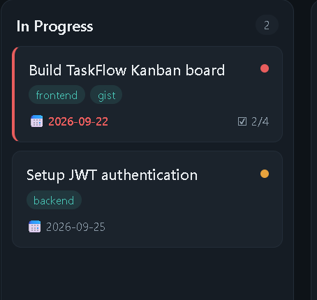
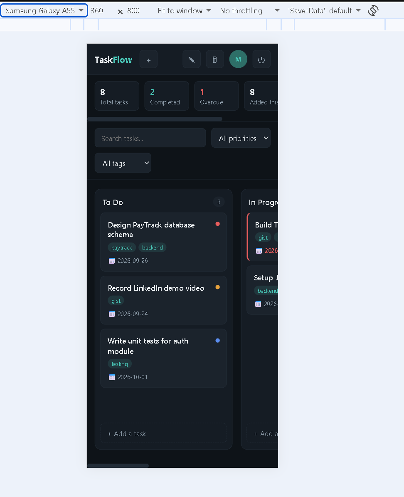

# TaskFlow — Kanban Task Management Web App


A full-stack Kanban-style task manager built for the GIST Full-Stack Web Development internship (**Task 2**). Not just a CRUD demo — it's designed to solve real task-management pain points with a production-style Spring Boot backend and a fully responsive vanilla JS frontend.

## 📸 Screenshots

| Register | Board View |
|---|---|
|  |  |

| Task Details | Overdue Highlighting |
|---|---|
|  |  |

### Mobile view


## 🎯 Live problems it solves

| Problem | Solution |
|---|---|
| Priority confusion | Color-coded priority dots (Low / Medium / High) |
| Missed deadlines | Automatic overdue highlighting (red border) on task cards |
| Overwhelming tasks | Subtask checklists to break work into steps |
| No visibility into progress | Dashboard stats bar — total, completed, overdue, completion % |
| Hard to find tasks | Search + filter by priority/tag |

## ✨ Features

- JWT authentication (register/login) with BCrypt password hashing
- **Strong password validation** — 8+ characters, uppercase, lowercase, and a number, with live client-side feedback and confirm-password matching
- Server-side validation on every endpoint (title/name length limits, required fields), with clean error messages instead of raw stack traces
- Multiple boards, each with 4 default columns: To Do, In Progress, Review, Done
- Drag-and-drop tasks between columns
- Task priority, due dates, tags, and subtask checklists
- Dashboard stats: total tasks, completed, overdue, added this week, completion %
- Search and filter by priority/tag
- Toast notifications for every action
- Fully responsive (desktop, tablet, mobile)

## 🧱 Tech Stack

**Backend:** Java 17 · Spring Boot 3.2.5 · Spring Security · JWT (jjwt) · Spring Data JPA · MySQL · Maven

**Frontend:** HTML5 · CSS3 · Vanilla JavaScript (Fetch API, native Drag-and-Drop API)

## 📁 Project Structure

```
taskflow/
├── backend/      Spring Boot REST API
│   └── src/main/java/com/faiz/taskflow/
│       ├── entity/        JPA entities (User, Board, BoardColumn, Task, Subtask, Tag)
│       ├── repository/    Spring Data repositories
│       ├── service/       Business logic
│       ├── controller/    REST controllers
│       ├── security/      JWT filter + service
│       └── config/        Security configuration
└── frontend/      Single-page vanilla JS frontend (index.html)
```

## 🚀 Setup

### Backend
1. Create a MySQL database (or let `createDatabaseIfNotExist=true` create it automatically).
2. Update `backend/src/main/resources/application.properties` with your MySQL username/password.
3. From the `backend/` folder, run:
   ```
   mvn spring-boot:run
   ```
4. The API starts on `http://localhost:8080`.

### Frontend
Open `frontend/index.html` directly in a browser, or serve it with a local dev server (e.g. VS Code Live Server). It talks to the backend at `http://localhost:8080/api`.

## 🔐 Validation & Security

- Passwords require 8+ characters, at least one uppercase letter, one lowercase letter, and one number (enforced both client-side and server-side)
- Passwords are hashed with BCrypt — never stored in plain text
- JWT tokens authenticate every request after login; protected routes reject requests without a valid token
- All write endpoints validate input length and required fields before touching the database

## 📡 API Overview

| Method | Endpoint | Description |
|---|---|---|
| POST | /api/auth/register | Create an account |
| POST | /api/auth/login | Log in, returns JWT |
| GET/POST | /api/boards | List / create boards |
| GET/PUT/DELETE | /api/boards/{id} | Get, rename, or delete a board |
| GET/POST | /api/columns/{columnId}/tasks | List / create tasks in a column |
| PUT/DELETE | /api/tasks/{id} | Update or delete a task |
| PATCH | /api/tasks/{id}/move | Move a task between columns (drag-and-drop) |
| GET/POST | /api/tasks/{taskId}/subtasks | List / add subtasks |
| PATCH/DELETE | /api/subtasks/{id} | Toggle or delete a subtask |
| GET | /api/dashboard/stats | Dashboard statistics |

## 🗺️ Possible next steps

- [ ] Deploy backend (Render/Railway) and frontend (Netlify/Vercel) for a live demo link
- [ ] Unit tests (JUnit/Mockito) for services and controllers
- [ ] Swagger/OpenAPI documentation

## 👤 Author

Muhammad Faiz Alam — [github.com/imfaiz56](https://github.com/imfaiz56) · [linkedin.com/in/faiz56](https://linkedin.com/in/faiz56)
